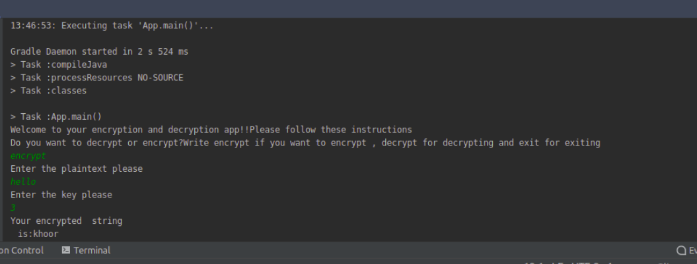
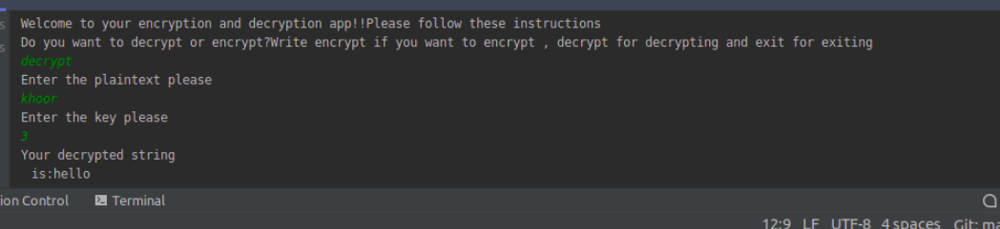

<h1>Caesar-Cipher</h1> 
<h5>Encrypting and decrypting Programs, November 14,2020</h5> 
<h5>By **Grace Umutesi**</h5>

## Setup/Installation Requirements
* This  needs a text editor like intellijIDEA and a browser.
* A github account in order to upload your projects.
* You will need to use the terminal for commands using Ubuntu os (You do not need to install any app or use a database)
<h1>Behavior-driven development</h1>
<h4>This is are the requirement:</h4>
<ul>
<li>The project should have working test for each class</li>
<li>It should have different classes one for encryption,  another for decription and another for the main function Which acts also also as the user interface </li>
<li>The user interface and the business logic should be separated.</li>
</ul>

<h4>scenario:</h4>
The user is asked to enter the text to be encrypted then input it, the program provide the place to input the key by which the text should be encrypted in number then the program provide the encrypted word after that the program provide a place to input the word to be decrypted which is then decrypted. 

<h4>Testing:</h4>
Unit testing with jUnit.
Complete test coverage
<h4> Known Bugs</h4>
No bugs found yet. 
<h4>Technologies Used</h4>
java
<h4>project details</h4>
The following are the screenshots showing an example of the result.

Encryption: using Hello with key=3 as example

Decryption: the digest(word after encryption) give back the initial word hello

<h1>License</h1>
*MIT License

Copyright (c) 2020 GraceUmutesi

Permission is hereby granted, free of charge, to any person obtaining a copy of this software and associated documentation files (the "Software"), to deal in the Software without restriction, including without limitation the rights to use, copy, modify, merge, publish, distribute, sublicense, and/or sell copies of the Software, and to permit persons to whom the Software is furnished to do so, subject to the following conditions:

The above copyright notice and this permission notice shall be included in all copies or substantial portions of the Software.

THE SOFTWARE IS PROVIDED "AS IS", WITHOUT WARRANTY OF ANY KIND, EXPRESS OR IMPLIED, INCLUDING BUT NOT LIMITED TO THE WARRANTIES OF MERCHANTABILITY, FITNESS FOR A PARTICULAR PURPOSE AND NONINFRINGEMENT. IN NO EVENT SHALL THE AUTHORS OR COPYRIGHT HOLDERS BE LIABLE FOR ANY CLAIM, DAMAGES OR OTHER LIABILITY, WHETHER IN AN ACTION OF CONTRACT, TORT OR OTHERWISE, ARISING FROM, OUT OF OR IN CONNECTION WITH THE SOFTWARE OR THE USE OR OTHER DEALINGS IN THE SOFTWARE.}* Copyright (c) 2020 Grace Umutesi

